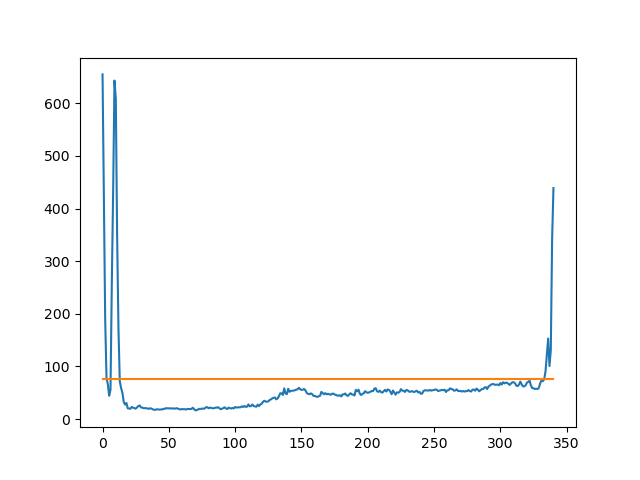
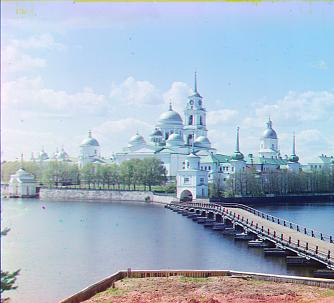
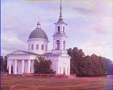

## 
**Images of the Russian Empire: Colorizing the**
## 
**Prokudin-Gorskii photo collection**
### 
**CS 194 Project 1**
### 
Wenzhe Tong
## Background
-----
[Sergei Mikhailovich Prokudin-Gorskii](http://en.wikipedia.org/wiki/Prokudin-Gorskii) (1863-1944)  was a man well ahead of his time. Convinced, as early as 1907, that color photography was the wave of the future, he won Tzar's special permission to travel across the vast Russian Empire and take color photographs of everything he saw including the only color portrait of [Leo Tolstoy](http://en.wikipedia.org/wiki/Leo_Tolstoy). 

His idea was simple: record three exposures of every scene onto a glass plate using a red, a green, and a blue filter. The LoC has recently digitized the negatives and made them available on-line.  

## Approach
-----
Since we want to align 3 color channels, with the idea of all color channel have similar brightness. So by comparing pixel brightness of 2 channels, use the Equation of Sum of Squared Differences (SSD) to represent alignment level. Find the lowest SSD to align 2 channels.  

When processing big images (around 3000x3000 pixels), it is computationally expensive. We use pyramid method to deal with the problem. We resize the photo and aligning form small picture to big picture. As for a image sized around 400x400, the shift is less than 15. Based on this, we determined our pyramid aligning parameters and implementing our algorithm.

## Bells and Whistles
-------
### **Auto Cropping**
We calculate SSD for each columns and rows. As figure shown below, SSD on edge is usually much more bigger than SSD in the middle of the picture. So we can compare average SSD and edge SSD to detect the edge and then crop them.

   
row SSD compared to average SSD 

### **Auto Cropping results**

|                                          |                                             |
|:----------------------------------------:|:-------------------------------------------:|
| |  |
|           after auto cropping            |               monastery.jpg                 |
| |  |
|           after auto cropping            |               cathedral.jpg                 |

## All Results
--------
|   |  |  |
|:--:|:---:|:--:|
| |  | |  
| cathedral-R[12,3]-G[5,2] | monastery-R[3,2]-G[-3,2] |tobolsk-R[6,3]-G[3,3]|  
||| |  
| emir-R[103,57]-G[49,24] | harvesters-R[124,13]-G[59,16] | icon-R[90,23]-G[41,17]|  
||| |  
| lady-r[116, 11]-g[56, 8].jpg |melons-r[178, 13]-g[82, 11].jpg  | onion_church-r[108, 36]-g[51, 27].jpg| 
||| |  
| self_portrait-r[176, 37]-g[79, 29].jpg |three_generations-r[112, 11]-g[53, 14].jpg  | train-r[87, 32]-g[43, 6].jpg| 
||| |  
| village-r[138, 22]-g[65, 12].jpg |building-r[1, 2]-g[1, 2].jpg  | church-r[4, 1]-g[2, 1].jpg| 
